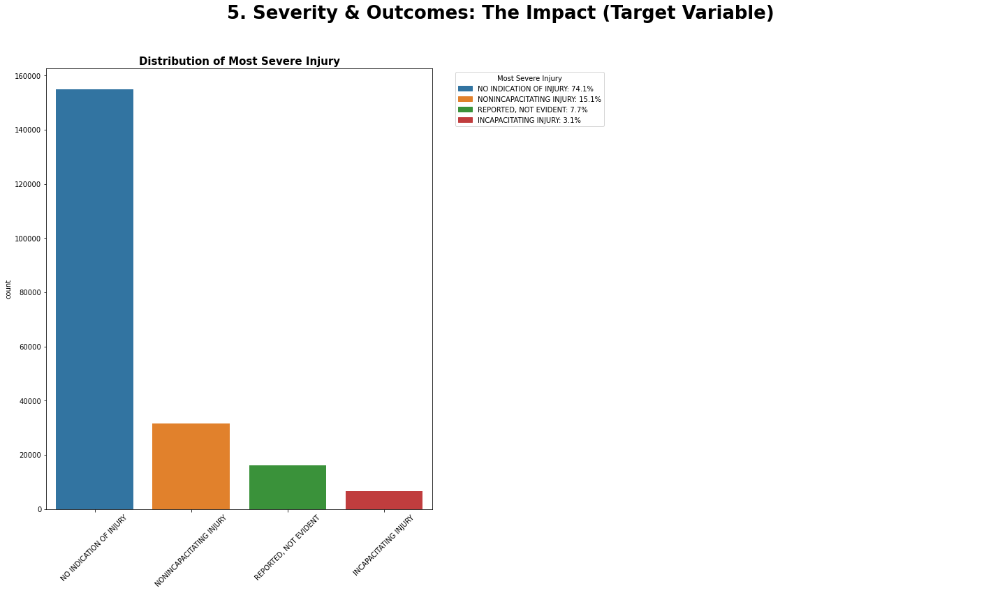
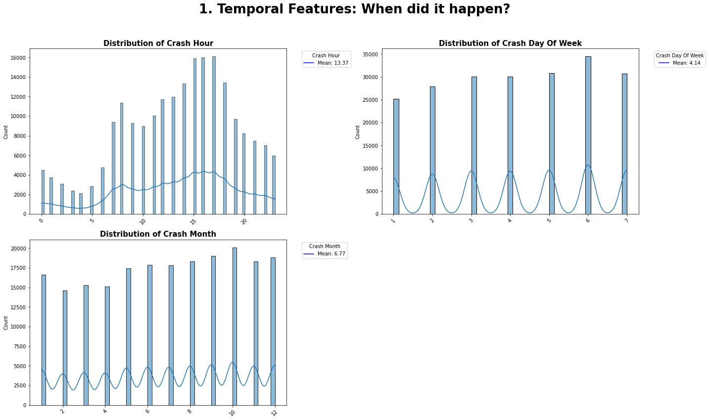
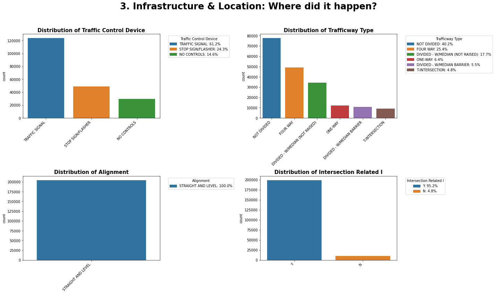
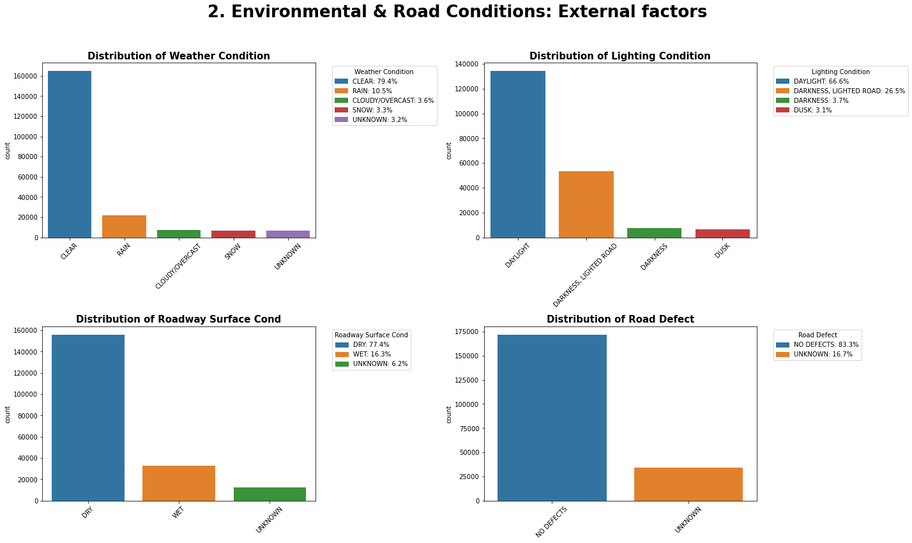
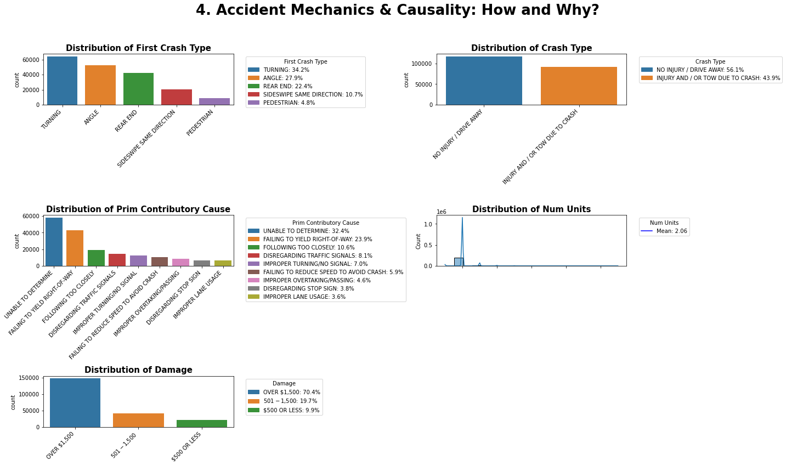

# 🚦 Traffic-Accident-Analysis-Insights

### A Data-Driven Approach to Public Safety & Risk Management

---

## 📋 Executive Summary
The primary objective of this project is to develop a predictive classification model to estimate the probability of **high-severity injuries** in traffic accidents. Accurately forecasting severity is critical for emergency response teams to prioritize resource allocation and for city planners to identify high-risk infrastructure.

Using a dataset of over 180,000 traffic records, this project moves from rigorous Exploratory Data Analysis (EDA) to Feature Engineering (removing data leakage) and Machine Learning (Logistic Regression), achieving a **Recall of 96%** for severe cases.

**Target Variable Distribution (Class Imbalance):**

*The dataset is heavily imbalanced, with severe injuries representing a minority of cases, necessitating specialized sampling techniques.*

---

## 💡 Key Intelligence Insights
Based on the analysis, we identified the specific factors that increase or decrease the risk of severe injury. The Logistic Regression coefficients allow us to see the **direction** of the impact:

**Actionable Takeaways:**
1.  **Intersections are the Kill Zone:** A staggering **95.2%** of all recorded accidents occur at intersections.
2.  **Vulnerable Users:** The presence of **Pedestrians** and **Cyclists** (Bars to the right in the chart above) drastically increases the probability of severe injury.
3.  **The "Clear Weather" Paradox:** Contrary to popular belief, **79%** of crashes occur in clear weather. This isolates **human error** (distraction, aggression) as the primary cause.

---

## 📊 Project Methodology

### 1. Exploratory Data Analysis (EDA)
We utilized **Seaborn** and **Matplotlib** to uncover patterns across multiple dimensions.

#### A. Temporal Analysis: When do crashes happen?
Analysis reveals a distinct peak during the evening rush hour (3 PM - 6 PM) and on Fridays, suggesting commuter fatigue is a major factor.

#### B. Infrastructure & Location
The data confirms that road geometry is rarely the issue (most roads are straight and level). The danger lies in **Traffic Control Devices** (signals/stop signs) where conflict points exist.

#### C. Environmental Conditions
Most accidents occur under "ideal" conditions (Clear weather, Dry roads, Daylight), indicating that drivers may lower their guard when the environment seems safe.

#### D. Crash Mechanics
"Turning" and "Angle" collisions are the most common types, reinforcing the finding that intersections are the primary hazard zones.

### 2. Feature Engineering & Selection
To handle the high dimensionality of the data, we performed One-Hot Encoding and filtered features based on their correlation with the target variable.

**Top 20 Features by Correlation:**

*We removed post-crash variables (like 'Ambulance Required') to prevent Data Leakage.*

---

## 📈 Model Performance
We deployed a **Logistic Regression** model with `class_weight='balanced'` to handle the severe class imbalance. The strategy was to prioritize **Recall** (Sensitivity) to create a "Safety Net" model.

| Metric | Score | Interpretation |
| :--- | :--- | :--- |
| **Recall (Severe)** | **0.96** | The model correctly identifies **96%** of all severe/fatal injuries. |
| **ROC-AUC** | **0.86** | Strong ability to distinguish between high-risk and low-risk scenarios. |
| **Precision** | **0.08** | Low precision indicates a high false-alarm rate, accepted as a necessary trade-off for safety. |

---

## 🛠️ Technologies Used
* **Language:** Python
* **Data Manipulation:** Pandas, NumPy
* **Visualization:** Matplotlib, Seaborn
* **Machine Learning:** Scikit-learn (LogisticRegression, RandomForestClassifier)
* **Environment:** Jupyter Notebook

-----

*This project was developed for educational and portfolio purposes to demonstrate end-to-end data analysis and modeling workflows in the context of Public Safety.*
